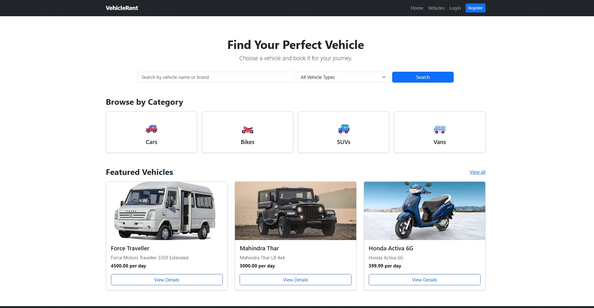
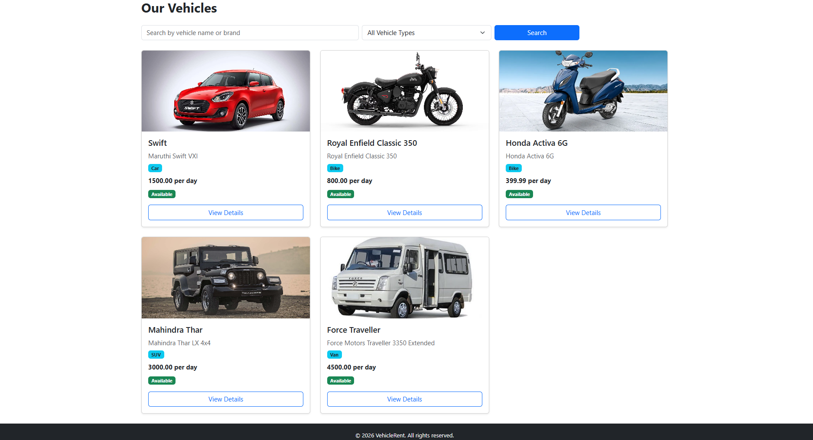
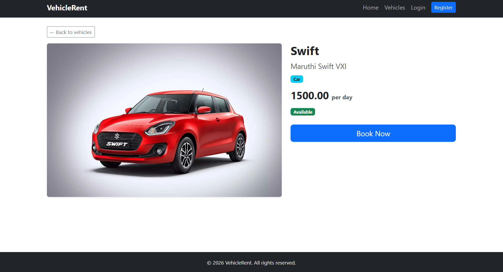
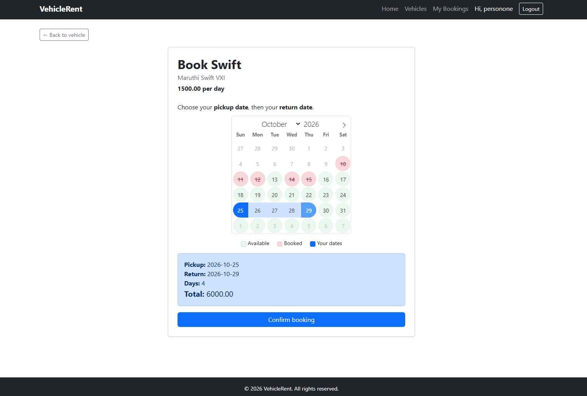
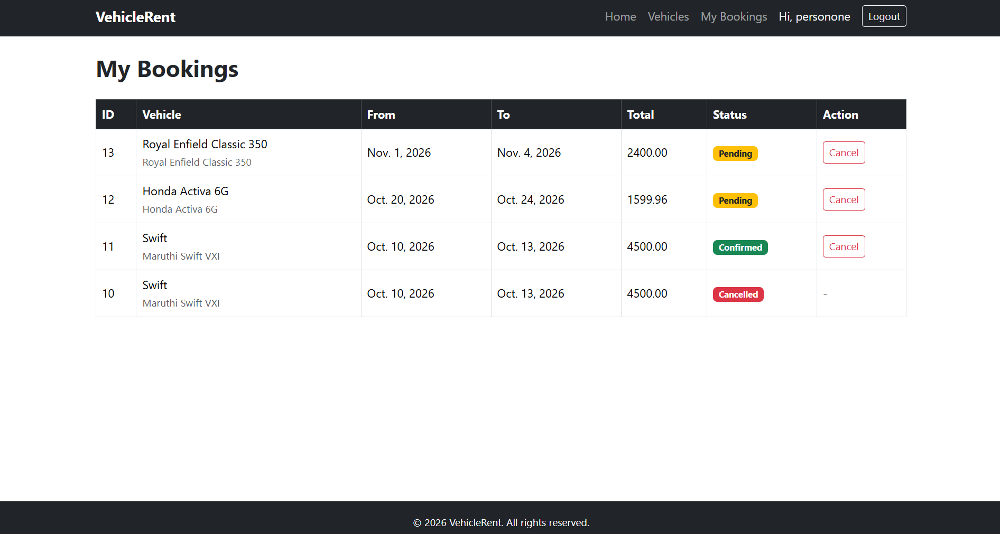
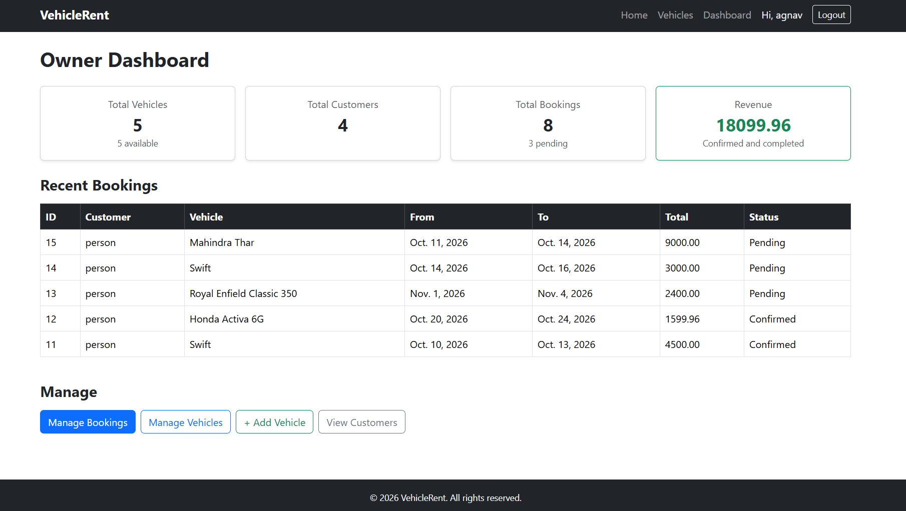
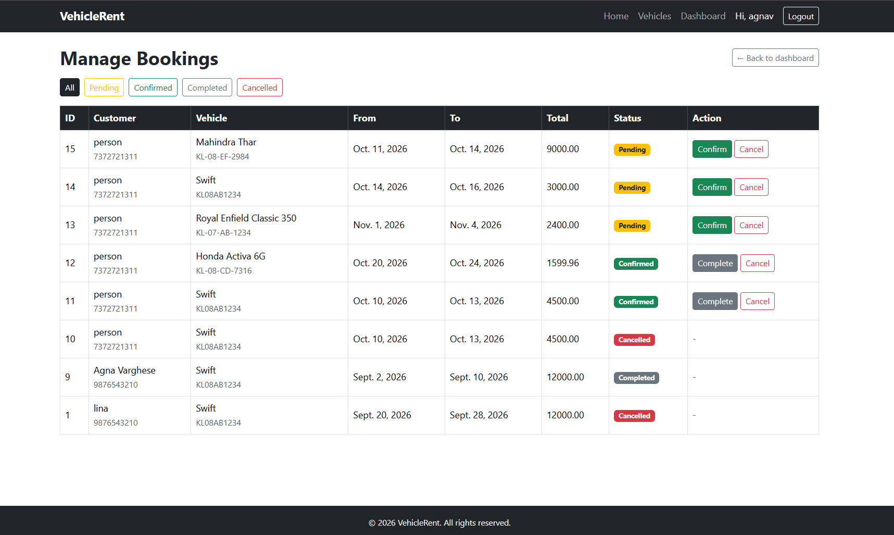

# Vehicle Rental & Booking System

A full-stack vehicle rental web application built with **Django**, **Django REST Framework**, and **MySQL**. Customers can browse and search vehicles, register, log in, book a vehicle for a date range, and manage their bookings. The owner gets an improved admin panel and a dashboard with business totals.

The booking engine prevents double bookings, calculates the rental duration and total cost automatically, and releases dates when a booking is cancelled.

## Screenshots

| Home | Vehicles |
|---|---|
|  |  |

| Vehicle details | Availability calendar |
|---|---|
|  |  |

| My bookings | Owner dashboard |
|---|---|
|  |  |

**Owner: manage bookings**


## Features

**Customers**
- Browse vehicles as cards, with search by name or brand and a vehicle type filter
- Vehicle detail page with price and availability
- Register and log in (session-based authentication)
- Book a vehicle from an availability calendar: booked days are shown in red, free days in green, and the chosen dates in blue, with the number of days and the total cost shown instantly
- Calendar blocks bookings that would cross an already-booked day (the server still validates every booking)
- View only their own bookings and cancel pending or confirmed ones (cancel and rebook to change dates)

**Booking rules**
- End date must be after the start date, with a minimum of one day
- Overlapping bookings for the same vehicle are rejected
- Cancelled bookings release their dates for other customers
- Rental duration and total amount are calculated automatically
- Booking statuses: Pending, Confirmed, Cancelled, Completed

**Owner and staff roles**
- Dashboard for staff and the owner with total vehicles, customers, bookings, and revenue (confirmed and completed bookings only), plus recent bookings
- Owner-only Manage Bookings page: filter by status and confirm, complete, or cancel bookings with one click (only valid status changes are allowed, so a cancelled booking can't be revived)
- Staff accounts can view the dashboard but cannot change any data; customers have access to the website only
- Django admin with columns, filters, search, and bulk actions for vehicles, customers, and bookings

**REST API** (under `/api/`)
- Full CRUD for vehicles, customers, and bookings
- Search and filters (type, availability, price range)
- Registration, login, and logout endpoints
- Role-based permissions: customers see only their own bookings, and management endpoints are admin-only

## Tech Stack

- Python, Django 5.2, Django REST Framework
- MySQL
- HTML, Bootstrap 5 (Django templates)
- Git and GitHub

## API Endpoints

| Method | Endpoint | Description | Access |
|---|---|---|---|
| GET, POST | `/api/vehicles/` | List (with filters) or add vehicles | List: public, Add: admin |
| GET, PUT, DELETE | `/api/vehicles/<id>/` | View, update, or delete a vehicle | View: public, others: admin |
| GET, POST | `/api/bookings/` | List own bookings or create a booking | Logged in |
| GET, PUT, DELETE | `/api/bookings/<id>/` | View, update, or delete a booking | Owner or admin |
| POST | `/api/bookings/<id>/cancel/` | Cancel a booking | Owner or admin |
| GET, POST | `/api/customers/` | List or add customers | Admin |
| GET, PUT, DELETE | `/api/customers/<id>/` | View, update, or delete a customer | Admin |
| POST | `/api/auth/register/` | Register a new customer | Public |
| POST | `/api/auth/login/` | Log in | Public |
| POST | `/api/auth/logout/` | Log out | Public |

Vehicle filters: `?search=`, `?type=`, `?available=true`, `?min_price=`, `?max_price=`

## Setup

1. Clone the repository:
```
   git clone https://github.com/agnavarghese404-max/vehicle-rental-booking-system.git
   cd vehicle-rental-booking-system
```
2. Create and activate a virtual environment, then install the packages:
```
   python -m venv venv
   venv\Scripts\activate
   pip install -r requirements.txt
```
3. Create a MySQL database named `vehicle_rental_db`.
4. Create a file named `.env` in the project folder (next to `manage.py`):
```
   SECRET_KEY='your-django-secret-key'
   DB_PASSWORD='your-mysql-password'
```
5. Create the tables and an admin account:
```
   python manage.py migrate
   python manage.py createsuperuser
```
6. Start the server and open http://127.0.0.1:8000/:
```
   python manage.py runserver
```

The database name, user (`root`), host, and port are set in `config/settings.py`. Change them there if your MySQL setup is different.

## Running the Tests

```
python manage.py test
```

The test suite covers the API permissions, login requirements, double-booking prevention, booking cancellation rules, and staff-only access to the dashboard.

## Project Structure

```
config/     Project settings and main URL configuration
rentals/    App with models, API views, serializers, permissions, website views, templates, and tests
```

## Future Improvements

- Online payment (currently payment is collected at pickup)
- Email notifications for booking confirmation
- Search the vehicle list by available dates
- Deployment with a live demo link

## Author

Agna Varghese  
GitHub: [agnavarghese404-max](https://github.com/agnavarghese404-max)